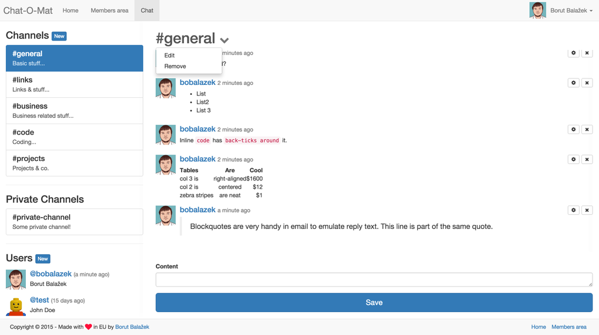

README
======
**Chat-O-Mat**

An Open-Source Slack / HipChat alternative. Currently still in development.

Requirements & Tools & Helpers
-------------------
* PHP > 5.3.9
* [Composer](https://getcomposer.org/) *
* [Bower](http://bower.io/) *
* [PHP Coding Standards Fixer](http://cs.sensiolabs.org/)

Setup / Development
-------------------
* With your console navigate to your project directory. For example: `cd /var/www/chat-o-mat` (create it before, if it doesn't exist yet - `mkdir /var/www/chat-o-mat`)
* Clone this repo: `git clone git@github.com:bobalazek/chat-o-mat.git .` (the dot at the end means, that it should clone into the current directory, and not wrap it with, in this case a 'myapp/' folder)
* Configure database (and maybe other stuff if you want): `app/configs/global-local.php` (just rename the global-local.php.dist and set your own configuration)
* Run the following commands:
    * `curl -sS https://getcomposer.org/installer | php -- --install-dir=bin` (skip this step, if you already have composer installed - globally)
    * `bin/composer.phar install`
    * `bin/console orm:schema-tool:update --force --dump-sql` (to install the database schema)
    * `bower update` (to install the frontend dependencies - you need to install [Bower](http://bower.io/) first - if you haven't already)
* You are done! Start chatting / developing!

Database
-------------------
* We use the Doctrine database
* Navigate to your project directory: `cd /var/www/chat-o-mat`
* Check the entities: `bin/console orm:info` (optional)
* Update the schema: `bin/console orm:schema-tool:update --force --dump-sql`
* Database updated!

Commands
--------------------
* `bin/console application:environment:prepare` - Will create the global-local.php and development-local.php files (if not existent)
* `bin/console application:database:hydrate-data --remove-existing-data` - Will hydrate the tables with some basic data, like: 4 chat channels, 2 users and 50 emojis (the `--remove-existing-data` flag will truncate all tables before re-hydrating them)
* `bin/console application:storage:prepare` - Will prepare all the storage (var/) folders, like: cache, logs, sessions, etc.
* `bin/console application:storage:prepare-shared-folders` - Will prepare shared folders for your server / deployment (you can set the shared folders inside the app/configs/global.php file)

Other commands
----------------------
* `sudo php-cs-fixer fix .` - if you want your code fixed before each commit. You will need to install [PHP Coding Standards Fixer](http://cs.sensiolabs.org/)

Preview
----------------------

### Chat Channel detail ###

### Chat Channel detail - Channels autocomplete ###

### Chat Channel detail - Emojis autocomplete ###

### Chat Channel detail - Users autocomplete ###

### Members Area - Users ###

Credits
----------------------
Icons - [Hawcons Emoji](http://www.flaticon.com/packs/hawcons-emoji-filled)

License
----------------------
Chat-O-Mat is licensed under the MIT license.
